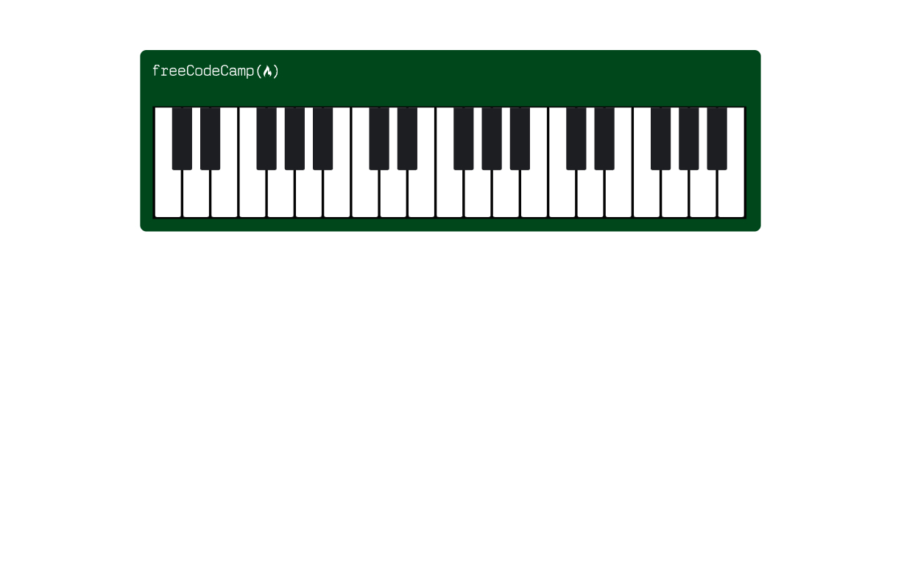

# Piano | FCC Responsive Web Design Certification

**Project 13/20**

A responsive piano interface created using pure HTML and CSS. This visual-only layout replicates the appearance of a real piano with accurately placed white and black keys. No images, audio, or JavaScript — just pure CSS creativity 🎶.

---

## 📚 Table of Contents

- [🔎 Overview](#-overview)
  - [📸 Screenshot](#-screenshot)
  - [🔗 Links](#-links)
  - [📌 Features](#-features)
- [🧠 My process](#-my-process)
  - [🛠️ Built with](#️-built-with)
  - [🎓 What I learned](#-what-i-learned)
  - [🔙 Previous Project](#-previous-project)
  - [🔜 Next Project](#-next-project)
- [👤 Author](#-author)
  - [🌐 Connect with Me](#-connect-with-me)
  - [💻 Coding Profiles](#-coding-profiles)

---

## 🔎 Overview

### 📸 Screenshot

### 🔗 Links

 - [🔴 Live Demo](https://dalascript.github.io/piano/)
 - [🗂️ GitHub Repository](https://github.com/DalaScript/piano)

### 📌 Features

 - ✅ Realistic piano key layout using only HTML & CSS
 - ✅ Visual distinction between white and black keys
 - ✅ Responsive design with media queries
 - ✅ Custom sizing and positioning using `float` and `position`
 - ✅ Clean and centered piano layout

## 🧠 My Process

### 🛠️ Built with

 - HTML5
 - CSS3

### 🎓 What I Learned

 - Structuring complex visuals using only HTML and CSS
 - Positioning overlapping elements with `position: absolute` and `::after`
 - Designing responsive components with flexible layouts
 - Using `float` for side-by-side element placement

  > 🚀 For me, this project was more about **practice** and gaining additional **experience**,  
  > rather than learning something entirely new.  
  >  
  > 👨‍💻 Since I’m not a beginner and already familiar with these technologies,  
  > I approached it with confidence — and still, I truly **enjoyed working on it**.  
  >  
  > 🎯 Overall, I consider this a very **valuable and enjoyable experience**.

### 🔙 Previous Project

 - Cat Painting | *[Project 12/20]* → [View Repository](https://github.com/DalaScript/cat-painting)

### 🔜 Next Project

 - Technical Documentation Page *(Certification Project)* | *[Project 14/20]* → [View Repository](https://github.com/DalaScript/technical-documentation-page)

---

## 👤 Author

### 🌐 Connect with Me

 - [Instagram](https://www.instagram.com/DalaScript)
 - [YouTube](https://www.youtube.com/@DalaScript)

### 💻 Coding Profiles

 - [freeCodeCamp](https://www.freecodecamp.org/DalaScript)
 - [FrontendMentor](https://www.frontendmentor.io/profile/DalaScript)
 - [GitHub](https://github.com/DalaScript)

*🙌 Thanks for checking out my project! More coming soon. Stay tuned 🚀*